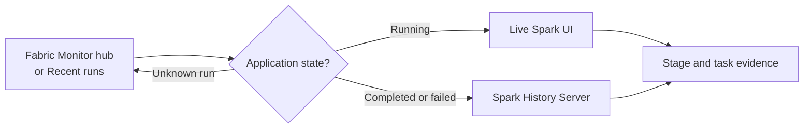

# The Spark Detective

## Diagnosing Spark Performance in Microsoft Fabric

Solving the case of the slow Spark job without memorizing every Spark UI tab.

Placeholder: title visual, Spark UI screenshot, or detective-style Fabric/Spark image

<!--
Open with the framing: this is a practical investigation, not a Spark UI tour.
Set expectations that the first part of the talk covers the mystery and the mental model needed to read Spark UI evidence.
Mention that screenshots can be added later once the demo environment or recorded captures are ready.
-->

---

# The Mystery

> The notebook finished yesterday in **12 minutes**. Today it runs for **55 minutes**.
>
> Nothing obvious changed. Where do we look?

  

    
12m

    
Yesterday

  

  

    
55m

    
Today

  

  

    
?

    
Root cause

  

<!--
Use this slide to create tension. Do not explain the answer yet.
Emphasize that Spark performance problems often do not fail loudly; they leave clues in runtime, stages, tasks, shuffle, spill, and executor behavior.
The audience should feel the common pain: same notebook, same code, very different runtime.
-->

---

# We Are Not Memorizing Tabs

## Avoid

- Opening random Spark UI tabs
- Changing tuning knobs first
- Treating every slow job as CPU-bound
- Stopping at job-level progress

## Do Instead

- Start from the right run
- Move from symptom to evidence
- Localize the expensive stage
- Build a testable hypothesis

We are here to learn where to look first.

<!--
Make the main promise of the talk explicit: a repeatable debugging workflow.
This slide prevents the talk from becoming a feature tour of Spark UI.
The key contrast is random tuning versus evidence-driven diagnosis.
-->

---

# Tiny Fabric Orientation

In Fabric, you usually do not start by typing a Spark UI URL.

| Situation | Use |
|---|---|
| The Spark application is still running | **Live Spark UI** |
| The Spark application completed or failed | **Spark History Server** |
| You do not know which run to inspect | **Monitor hub / Recent runs** |

Placeholder: screenshot of Fabric Monitor hub, Recent runs, or notebook run details

<!--
Keep this orientation deliberately short. The goal is just to anchor Spark UI inside the Fabric experience.
Explain that live Spark UI is for active applications, while History Server is for completed or failed applications.
If the audience does not know which run is relevant, they should start in Monitor hub or Recent runs before drilling into Spark internals.
-->

---

# The First Decision

Find the run, choose live or post-mortem, then read the Spark evidence.

<!--
Use the diagram to make the Fabric entry path memorable.
The important point is that Fabric gives the starting point and operational context, while Spark UI and History Server provide detailed execution evidence.
Transition from here into the mental model: once we reach Spark evidence, we need enough vocabulary to interpret what we see.
-->

---

# Spark UI Mental Model

Most Spark diagnosis is about moving from
application-level symptoms
to
stage-level
and
task-level evidence.

<!--
This is the section 2 transition slide.
Explain that the audience does not need a full Spark internals course. They need just enough vocabulary to read Spark UI like evidence.
Frame the hierarchy before introducing individual terms.
-->

---
zoom: 0.85
---

# Job

Concept 1 of 5 · the unit that gets triggered

  

    
A job is…

    
One <b>user action</b> or <b>SQL execution</b>—the thing you asked Spark to do.

    

      <b>Where it lives in the UI</b>
      The <code>Jobs</code> tab: one row per action, with its trigger, duration, stages, and tasks.
    

    

      <b>Triggered by</b>
      <code>count()</code> · <code>collect()</code> · <code>write…</code> · <code>show()</code> · a SQL query
    

  

  

    
Completed Jobs (4)

    
IdDescriptionDurationTasks

    
9show at console:240.4 s1 / 1

    
8count at orders.scala:382.1 s208 / 208

    
<b>7</b><b>parquet at writer.scala:91</b><b>1m 12s</b>812 / 812

    
6collect at repl.scala:110.8 s4 / 4

  

<!--
A job is the unit Spark creates when an action asks it to produce a result. Transformations remain lazy; actions such as count, collect, show, or write trigger work.

In the Jobs tab, one row represents that request. A single application can contain many jobs, and one SQL execution can create more than one job.

Use the description to connect the row back to notebook code, then open the job to see the stages Spark needed.
-->

---
zoom: 0.85
---

# Stage

Concept 2 of 5 · the boundary that matters

  

    
A stage is…

    
A run of work Spark can do <b>without moving data</b>. A <b>shuffle</b> creates the next stage.

    

      <b>The rule</b>
      <code>groupBy</code>, <code>join</code>, <code>repartition</code>, and windows often create a shuffle—and therefore a stage boundary.
    

    

      <b>Where it lives in the UI</b>
      The <code>Stages</code> tab, or the DAG visualisation inside a job.
    

  

  

    
DAG · Job 7

    

      

        
<b>Stage 12</b>200 tasks

        
Scan parquet [orders]

        
Filter status = paid

        
HashAggregate (partial)

      

      

        
⇄

        <b>SHUFFLE</b>
        <small>data moves</small>
      

      

        
<b>Stage 13</b>200 tasks

        
HashAggregate (final)

        
Sort

        
WriteFiles

      

    

  

<!--
A stage groups operations that Spark can pipeline without redistributing data. The important boundary is the shuffle.

Here Spark scans, filters, and performs a partial aggregation in Stage 12. The shuffle redistributes records by key. Stage 13 can then finish the aggregation and write the result.

That is why joins, aggregations, repartitioning, and windows matter during an investigation: they often create the boundaries where data moves, waits, or spills.
-->

---
zoom: 0.85
---

# Task

Concept 3 of 5 · the atom of execution

  

    
A task is…

    
<b>One partition’s</b> unit of work within a stage.

    

      <b>The relationship</b>
      <code>tasks per stage</code> = <code>partitions in that stage</code>. The tasks run the same code on different data.
    

    

      <b>Where it lives in the UI</b>
      Stage detail → task table and timeline. Skew, slow tasks, GC, and spill become visible here.
    

  

  

    
Stage 12 · 6 of 200 tasks shown

    
PartitionTaskDurationTime

    
P00<i style="width:18%"></i>0.41 s

    
P11<i style="width:20%"></i>0.47 s

    
<b>P2</b><b>2</b><i style="width:100%"></i><b>8.2 s</b>

    
P33<i style="width:17%"></i>0.39 s

    
P44<i style="width:19%"></i>0.44 s

    
P55<i style="width:19%"></i>0.45 s

  

<!--
A task is the same stage logic applied to one partition. Two hundred partitions produce two hundred tasks for that stage.

That relationship makes the task table diagnostic. Most tasks here finish in under half a second, but Task 2 takes more than eight seconds. The stage cannot finish until its slowest task does.

Job-level progress hides this shape. Stage detail reveals skew, stragglers, spill, GC, retries, and shuffle fetch wait at the level where they happen.
-->

---
zoom: 0.85
---

# Executor

Concept 4 of 5 · where the work runs

  

    
An executor is…

    
A worker <b>JVM process</b> that runs tasks in parallel slots and holds cached data.

    

      <b>The math</b>
      <code>parallel tasks</code> ≈ <code>executors × cores</code>. With 12 cores available, only about 12 tasks run at once.
    

    

      <b>Where it lives in the UI</b>
      The <code>Executors</code> tab: active tasks, memory, GC time, shuffle, and executor logs.
    

  

  

    
Active Executors

    
ExecutorHostSlotsMemory

    
drivernode-00● ● ● ●1.1 GB

    
<b>exec-01</b>node-01● ● ● ●5.8 / 8 GB

    
exec-02node-02● ● ● ●4.2 / 8 GB

    
exec-03node-03● ● ● ●6.1 / 8 GB

    
exec-04node-04● ● ● ●3.7 / 8 GB

    
exec-05node-05● ● ● ●6.4 / 8 GB

  

<!--
Executors are the worker processes that perform tasks. Their cores determine how many tasks can run concurrently; the rest wait for a slot.

The Executors tab shows where pressure lands. Compare active tasks, memory use, GC time, shuffle traffic, and failed tasks across executors.

An imbalance can support a skew hypothesis. Pressure across every executor points instead toward a cost shared by the stage, such as broad memory or shuffle pressure.
-->

---
zoom: 0.85
---

# SQL tab

Concept 5 of 5 · why those stages exist

  

    
The SQL tab is…

    
The <b>physical plan</b> Spark actually chose for a SQL or DataFrame query.

    

      <b>Read it like this</b>
      Every <code>Exchange</code> is a shuffle—and therefore a stage boundary. Metrics hang from each operator.
    

    

      <b>Why it matters</b>
      Jobs and stages show <i>what</i> ran. The SQL plan explains <b>why</b>.
    

  

  

    
Physical plan · orders JOIN customers

    

      
WriteFiles <small>812 rows · 3.4 MB</small>

      

      
SortMergeJoin <small>inner · customer_id</small>

      

      

        

          
Exchange (hash)<small>shuffle · 18 MB</small>

          

          
HashAggregate

          

          
Scan orders

        

        

          
Exchange (hash)<small>shuffle · 4 MB</small>

          

          
Filter active

          

          
Scan customers

        

      

    

  

<!--
The SQL tab connects the runtime evidence back to the physical work Spark chose.

Read this plan from the scans upward. Both sides pass through an Exchange, so Spark redistributes both datasets before the sort-merge join. Those exchanges explain the stage boundaries visible elsewhere in the UI.

Use operator metrics to connect an expensive stage to a join, aggregation, scan, or write. The metrics tell you what hurts; the plan explains why that work exists.
-->

---
layout: default
clicks: 6
---

# The Detective's Field Guide

One path. Every case.

<DetectiveFieldGuide :active="$clicks" />

  A slow job is a symptom. Walk the evidence.
  Do not skip ahead to a favorite tuning knob.
  A case ends with one testable hypothesis.

<!--
We have enough Spark vocabulary now. We need a route through the evidence.

I will use this field guide for every case in the rest of the session. The data and symptoms will change, but these six moves stay fixed.

[click] Find the right run. Check the application, attempt, input volume, and timing before opening low-level metrics.

[click] Choose the right lens. Use the live Spark UI while the application runs. Use History Server after it completes or fails.

[click] Localize the costly stage. Sort by duration and find the stage that accounts for the wall-clock time.

[click] Inspect the task shape. Look past averages. Check whether tasks finish together, form a long tail, spill, wait, or retry.

[click] Correlate that stage with the SQL plan, executors, Fabric Diagnosis views, and logs. Each view should support or challenge the same explanation.

[click] Test one hypothesis. Change one thing, rerun, and compare the same evidence.

Say the verbs once more: Find. Choose. Localize. Inspect. Correlate. Test.
-->

---
zoom: 0.85
---

# Start with the right case

<DetectiveFieldGuide :active="2" compact />

  

    
1 · FIND

    <h2 class="mt-2">Which run changed?</h2>
    

      
<b>Monitor hub</b><small>across items</small>

      
<b>Recent runs</b><small>from the workload</small>

      
<b>App details</b><small>one application</small>

    

    
Compare duration, input volume, status, and timing before drilling down.

  

  

    
2 · CHOOSE

    <h2 class="mt-2">Which lens has the evidence?</h2>
    

      
RUNNING<b>Live Spark UI</b>

      
DONE / FAILED<b>Spark History Server</b>

      
CONTEXT<b>Application details & logs</b>

    

  

Wrong run in, wrong diagnosis out.

<!--
Start with the question from the opening: yesterday took 12 minutes and today took 55. Before we diagnose Spark, we need both application records. Confirm that they ran the same notebook or job definition and identify the relevant attempt. Compare input volume, start time, status, and capacity context.

Use Monitor hub when you need to search across workspace activity. Use Recent runs when you begin from a notebook, Spark Job Definition, or pipeline. Open the application details page once you have the application.

Then choose the evidence source. A running application gives us the live Spark UI. A completed or failed application gives us the History Server. The application details page remains useful for resources, logs, and operational context.

Fabric's extended History Server also has Diagnosis views for data skew, time skew, and executor usage. We will use those views to confirm evidence later. They do not replace choosing the correct application.

Transition: now we have the right case file and the right lens. We can ask where the time went.
-->

---
zoom: 0.85
---

# Localize the cost

<DetectiveFieldGuide :active="3" compact />

  

    
StageDurationTasksShuffleSpill

    
31m 18s2002.1 GB0

    
<b>8</b><b>36m 42s</b>20086 GB41 GB

    
122m 04s484.8 GB0

  

  

    
3 · LOCALIZE

    <h2 class="mt-2">Ask first</h2>
    
Is the whole application slow—or does one stage explain it?

    <ul class="mt-5 text-lg leading-relaxed">
      <li>Sort by duration</li>
      <li>Notice retries or failures</li>
      <li>Compare shuffle and task count</li>
    </ul>
  

  Open the stage that explains the runtime.

<!--
Give the audience a few seconds to scan the table. Ask: which row would you open first?

Stage 8 took 36 minutes and 42 seconds. The other visible stages took about one or two minutes. Stage 8 accounts for most of this application's runtime, so it becomes our investigation boundary.

The row gives us early clues. It processed 86 GB of shuffle and spilled 41 GB. Those numbers deserve attention, but they do not prove a cause. A large shuffle can be expected. Spill can hurt without explaining the full delay. We need the task detail next.

Also check failed and retried stages. A stage may appear several times because Spark retried it, which can hide the true cost if you inspect only the final successful attempt. An unusual task count can expose poor parallelism before you open the stage.

The discipline here saves time: rank stages by their contribution to runtime, then open the one that can explain the symptom.
-->

---

# Read the shape of the tasks

<DetectiveFieldGuide :active="4" compact />

  

    
Balanced

    

      <i style="height:62%"></i><i style="height:68%"></i><i style="height:65%"></i><i style="height:71%"></i><i style="height:64%"></i>
    

    <b>Tasks finish together</b>
    <small>Look elsewhere for the bottleneck.</small>
  

  

    
Long tail

    

      <i style="height:24%"></i><i style="height:28%"></i><i style="height:22%"></i><i style="height:31%"></i><i style="height:94%"></i>
    

    <b>A few tasks dominate</b>
    <small>Suspect skew or a straggler.</small>
  

  

    
Pressure

    

      <i style="height:76%"></i><i style="height:86%"></i><i style="height:80%"></i><i style="height:91%"></i><i style="height:84%"></i>
    

    <b>Many tasks are expensive</b>
    <small>Check spill, GC, fetch wait, and I/O.</small>
  

  durationshuffle readspillGC timefetch waitretries

The average hides the case. The distribution reveals it.

<!--
Task distributions reveal what a stage average conceals.

Start on the left. These tasks finish in a narrow range. Balanced does not mean fast; it means no small group of tasks controls the stage duration. If every task is slow, investigate a cost shared across the stage, such as heavy shuffle, spill, CPU work, or external I/O.

The middle shape has a long tail. Most tasks finish, while one task keeps the stage alive. Compare shuffle read and input size per task. One task reading far more data points toward skew. Similar input with one slow task points toward a straggler, executor issue, or external delay.

On the right, many tasks consume substantial time. Check spill, GC time, shuffle fetch wait, scheduler delay, and retries. These metrics separate memory pressure, data movement, scheduling, and unstable execution.

Use medians, percentiles, and the task table where available. An average blends the fast majority with the expensive tail.

We will recall these three shapes in the cases: balanced with spill, a skewed long tail, and broad pressure from shuffle or weak parallelism.
-->

---
zoom: 0.85
---

# Corroborate before you accuse

<DetectiveFieldGuide :active="5" compact />

  

    
SQL PLAN

    <h2>Why does this stage exist?</h2>
    
Join strategy · exchanges · aggregations

  

  

    
STAGE + TASKS

    <h2>What hurts?</h2>
    
Duration · shape · shuffle · spill

  

  

    
EXECUTORS

    <h2>Where does pressure land?</h2>
    
GC · memory · workload imbalance

  

  

    
FABRIC

    <h2>What confirms it?</h2>
    
Diagnosis · graph · application logs

  

  
<b>One clue</b> a suspicion

  
→

  
<b>Independent clues agree</b> a hypothesis worth testing

<!--
We have localized the stage and read its task shape. Now we need independent evidence.

Keep the stage at the center. In the SQL view, find the operator connected to that stage. Exchanges show shuffle boundaries. The join strategy or aggregation explains why Spark created the expensive work.

Move to Executors when the task metrics suggest memory pressure, GC, or uneven usage. Check whether the pressure appears across executors or concentrates on one worker. A single unhealthy executor tells a different story from every executor spilling.

Fabric adds useful post-mortem evidence. The Diagnosis tab can flag data skew, time skew, and executor usage. The Graph view helps connect jobs and stages. Application and executor logs can confirm fetch failures, repeated loss, or an external error.

Keep one identifier in your head as you move between views: the same stage, task, executor, or SQL node. Opening more tabs does not strengthen a case. Two independent clues that describe the same bottleneck do.

Transition: once the clues agree, phrase a claim that a rerun can disprove.
-->

---
zoom: 0.85
---

# End with one testable hypothesis

<DetectiveFieldGuide :active="6" compact />

  

    
EVIDENCE

    <b>Stage 8 dominates</b>
    Tasks are balanced; shuffle and spill rose
  

  
→

  

    
HYPOTHESIS

    <b>The larger shuffle crossed a memory threshold</b>
    Not “Spark needs more tuning”
  

  
→

  

    
ONE TEST

    <b>Reduce shuffle volume</b>
    Rerun and compare the same stage metrics
  

  
Change five knobs and hope

  
Change one thing and learn

Evidence → hypothesis → test → compare

<!--
Use a three-part sentence to close the investigation.

First, state the evidence with numbers: Stage 8 accounts for most of the runtime. Its tasks finish in a similar range. Shuffle volume and spill increased compared with the faster run.

Second, name one cause: the larger shuffle crossed a memory threshold, so tasks wrote intermediate data to disk. This claim predicts what we should see after a targeted change.

Third, define the test. Reduce the shuffle volume, pre-aggregate earlier, or adjust partitioning. Pick one change for the rerun. Then compare Stage 8 duration, spill, shuffle volume, and task distribution with the original run.

Wall-clock time alone gives weak confirmation because capacity load and external systems can vary between runs. The stage metrics tell us whether our change affected the mechanism we suspected.

If the predicted metrics stay flat, reject the hypothesis and return to the evidence. That result still teaches us more than changing several settings at once.
-->

---

# Same route. New evidence.

<DetectiveFieldGuide :active="0" />

  
<b>Case 1</b>Data grew and spilled

  
<b>Case 2</b>One straggler hid the skew

  
<b>Case 3</b>Too much moving, too few hands

Reset to Find. Follow the clues.

<!--
Before the cases, ask the room to recall the route. Point to each card and let them supply the verb: Find. Choose. Localize. Inspect. Correlate. Test.

Each case starts from the left again. In Case 1, data volume grows and a stage spills. In Case 2, one hot key creates a long tail. In Case 3, shuffle and low parallelism leave resources idle.

Keep this ribbon visible during each walkthrough. Move the highlight as we change views. The audience should know why we click a stage, task, SQL node, or executor before the screen changes.

Set up Case 1: return to the 12-minute run that became a 55-minute run. We already know the route. Now we will work the evidence.
-->

