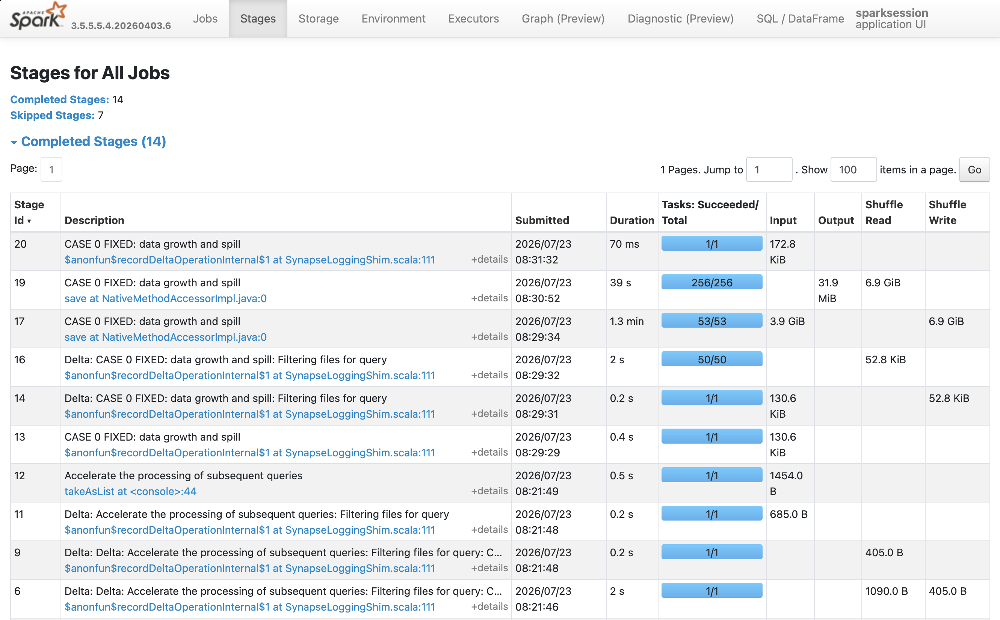
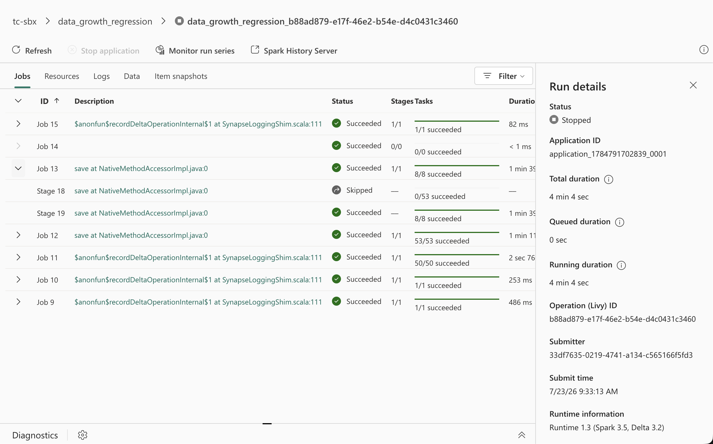

European Microsoft Fabric and SQL Community Conference · Barcelona · 28 September–1 October 2026

<!--
Official conference opening slide. The session title follows as slide 2, as required by the EMFCC26 speaker template.
-->

---
class: emfcc-title
---

Do not record or livestream this session

  <h1>The Spark Detective</h1>
  <h2>The curious case of the slow Spark job: a detective's toolbox</h2>
  
Thibauld Croonenborghs

  

    Data Architect · AE NV · Belgium
    
  

<!--

Who is working with Spark in Fabric?
Who has already worked with the Spark UI?
Who has already diagnosed a problem using the Spark UI?

This is a practical investigation.
I don’t want you to learn how to solve every issue in spark. Also in the practical cases I will throw some technical terms around (like sortmergejoin, broadcase join, etc.) the goal of this session is not to remember them, but the goal is to give you a reusable workflow to find possible issues using the Spark UI.
-->

---

# The Mystery

> The notebook finished yesterday in **12 minutes**. Today it runs for **55 minutes**.
>
> Nothing obvious changed. Where do we look?

  

    
12m

    
Yesterday

  

  

    
55m

    
Today

  

  

    
?

    
Root cause

  

<!--
Emphasize that Spark performance problems often do not fail loudly; they leave clues in runtime, stages, tasks, shuffle, spill, and executor behavior.
sometimes jobs fail and it is a mystery. You will become the detective and need to follow the clues, do your due dilligence and find the culprit to the crime 
-->

---
zoom: 0.85
---

# Spark architecture: driver to workers

  

    
NOTEBOOK / APPLICATION

    

      ▤
      <b>groupBy("zone").count()</b>
    

    An action plugs into the driver.
  

  
→ submit

  

    
DRIVER NODE

    
Application coordinator

    
Plans the work, schedules it, and tracks progress.

    
The driver coordinates; executors process the data.

  

schedule work to the cluster

  

    <b>WORKER NODES</b>
  

  

    

      

        <i></i><i></i><i></i><i></i>
        <b>Worker 1</b><small>node-01</small>
      

      

        
<b>EXECUTOR</b>parallel slots

        
<i></i><i></i><i></i><i></i>

      

      
runs partitions

    

    

      

        <i></i><i></i><i></i><i></i>
        <b>Worker 2</b><small>node-02</small>
      

      

        
<b>EXECUTOR</b>parallel slots

        
<i></i><i></i><i></i><i></i>

      

      
runs partitions

    

    

      

        <i></i><i></i><i></i><i></i>
        <b>Worker 3</b><small>node-03</small>
      

      

        
<b>EXECUTOR</b>parallel slots

        
<i></i><i></i><i></i><i></i>

      

      
runs partitions

    

  

<!--
Spark cluster

The Spark cluster is created as follows: 1 driver, 1 or more workers or nodes

Start on the left: the notebook submits an action to the driver. The driver is the coordinator. It plans the work, schedules it, and tracks progress; it is not where all the rows are processed. Notebook asks SparkSession this is a driver process. SparkSession manages Spark application (1-to-1 relation)

When an action runs—such as count(), show(), collect(), or write()—the driver:
     - analyzes and optimizes the logical plan
     - chooses a physical plan, such as Filter, Exchange, or SortMergeJoin
     - splits it into stages at shuffle boundaries
     - sends tasks to executors

The driver fans work out to multiple worker nodes. Each worker hosts an executor with several parallel slots, so partitions can be processed at the same time. More workers mean more possible parallelism.
Executors process their assigned partitions. They read data, run the pipelined operators, perform shuffles where necessary, and return results or write output.
-->

---

# One action becomes a job

A concrete example of the hierarchy

  

    
NOTEBOOK

    
trips = spark.read.table("trips")&nbsp;(trips.filter("fare is positive")&nbsp;&nbsp;&nbsp;&nbsp;&nbsp;&nbsp;.groupBy("zone")&nbsp;&nbsp;&nbsp;&nbsp;&nbsp;&nbsp;.count()&nbsp;&nbsp;&nbsp;&nbsp;&nbsp;&nbsp;.write.saveAsTable("daily"))

    
<b><code>write()</code></b> is the action: Spark must now do the work.

  

  
→<small>triggers</small>

  

    
JOB 7<b>write()</b>

    

      
<b>STAGE 0</b><small>read · filter · partial aggregate</small>

      
<i>Task 0</i><i>Task 1</i><i>Task 2</i><i>Task 3</i>

    

    
<b>↕ &nbsp; SHUFFLE &nbsp; ↕</b><code>groupBy("zone")</code> redistributes rows by zone

    

      
<b>STAGE 1</b><small>final aggregate · write</small>

      
<i>Task 0</i><i>Task 1</i><i>Task 2</i>

    

  

  <b>An action</b> creates a job<i v-click="1">→</i><b>A shuffle</b> starts a new stage<i v-click="2">→</i><b>Each partition</b> becomes a task

<!--
spark hierarchy of execution 

2 types of building blocks in a Spark job: A transformation creates a new RDD/DataFrame from an existing one (it describes a step in your pipeline - like a select, filter, join etc) and is evaluated lazily. An action asks Spark to materialize a result (return to the driver, write to storage, or otherwise “finish” the computation), which is what triggers a job in Spark’s execution model.

Stage 0 reads, filters, and performs a partial aggregate across four partitions, so it has four tasks. 
A task processes one partition and can pipeline several narrow operations without materializing intermediate results: read → select → filter → map
groupBy redistributes rows by zone: that shuffle ends Stage 0. Stage 1 performs the final aggregate and writes its three output partitions.

Clarify the potentially confusing `count()` here: `groupBy("zone").count()` is a grouped DataFrame aggregation that returns a new DataFrame, so it is still lazy in this chain. A standalone `df.count()` is different: it is an action, materializes the result, and creates a job. In this example the final `write()` is the action that triggers the whole plan.
-->

---

# Spark UI in practice

  

<!--
Fabric: extended history server. For a completed run in Fabric, the Spark History Server adds two useful investigation views:

- **Graph**: select a Job ID, then open Graph to see the job DAG and its stage flow. Switch between progress, read, and written data; select a stage node to open its stage details. Use it to understand how the stages connect and where the work is concentrated.
- **Diagnosis**: select a Job ID, then open Diagnosis. Fabric highlights Data Skew, Time Skew, and Executor Usage Analysis. These are shortcuts to patterns we could otherwise find manually in task tables and executor timelines.

Also add things like: snapshot-based loading and executor rolling logs
-->

---
zoom: 0.85
---

# Job

  

    
A job is…

    
One <b>user action</b> or <b>SQL execution</b>

    

      <b>Where it lives in the UI</b>
      The <code>Jobs</code> tab: one row per action, with its trigger, duration, stages, and tasks.
    

    

      <b>Triggered by</b>
      actions, like <code>count()</code> · <code>collect()</code> · <code>write…</code> · <code>show()</code> · a SQL query
    

  

  

    
Completed Jobs (4)

    
IdDescriptionDurationTasks

    
9show at console:240.4 s1 / 1

    
8count at orders.scala:382.1 s208 / 208

    
<b>7</b><b>parquet at writer.scala:91</b><b>1m 12s</b>812 / 812

    
6collect at repl.scala:110.8 s4 / 4

  

<!--
A job is the unit Spark creates when an action asks it to produce a result. Transformations remain lazy; actions such as count, collect, show, or write trigger work.

In the Jobs tab, one row represents that request. A single application can contain many jobs, and one SQL execution can create more than one job.

Use the description to connect the row back to notebook code, then open the job to see the stages Spark needed.
-->

---
zoom: 0.85
---

# Stage

  

    
A stage is…

    
A run of work Spark can do <b>without moving data</b>. A <b>shuffle</b> creates the next stage.

    

      <b>Where it lives in the UI</b>
      The <code>Stages</code> tab, or the DAG visualisation inside a job.
    

    

      <b>Triggered by</b>
      <code>groupBy</code>, <code>join</code>, <code>repartition</code>, and windows often create a shuffle
    

  

  

    
DAG · Job 7

    

      

        
<b>Stage 12</b>200 tasks

        
Scan parquet [orders]

        
Filter status = paid

        
HashAggregate (partial)

      

      

        
⇄

        <b>SHUFFLE</b>
        <small>data moves</small>
      

      

        
<b>Stage 13</b>200 tasks

        
HashAggregate (final)

        
Sort

        
WriteFiles

      

    

  

<!--
A stage groups operations that Spark can pipeline without redistributing data. The important boundary is the shuffle. Shuffles are triggered by something called wide transformations
Narrow: transformations for which each input partition will contribute to only one output partition (filter)
Wide: input partitions will contribute to many output partitions
a join is logically a transformation, but whether it creates a wide dependency depends on the physical join strategy.

Here Spark scans, filters, and performs a partial aggregation in Stage 12. The shuffle redistributes records by key. Stage 13 can then finish the aggregation and write the result.

That is why joins, aggregations, repartitioning, and windows matter during an investigation: they often create the boundaries where data moves, waits, or spills.
-->
---
zoom: 0.85
---

# Task

  

    
A task is…

    
<b>One partition’s</b> unit of work within a stage.

    

      <b>Where it lives in the UI</b>
      Stage detail → task table and timeline. Skew, slow tasks, GC, and spill become visible here.
    

    

      <b>The relationship</b>
      <code>tasks per stage</code> = <code>partitions in that stage</code>. The tasks run the same code on different data.
    

  

  

    
Stage 12 · 6 of 200 tasks shown

    
PartitionTaskDurationTime

    
P00<i style="width:18%"></i>0.41 s

    
P11<i style="width:20%"></i>0.47 s

    
<b>P2</b><b>2</b><i style="width:100%"></i><b>8.2 s</b>

    
P33<i style="width:17%"></i>0.39 s

    
P44<i style="width:19%"></i>0.44 s

    
P55<i style="width:19%"></i>0.45 s

  

<!--
why does this view matter? They say a chain is only as strong as its weakest link. Well, a stage is only as fast as its slowest task.
 The Task view is useful because job-level or stage-level averages can hide the actual bottleneck.

A task is the same stage logic applied to one partition. Two hundred partitions produce two hundred tasks for that stage.

That relationship makes the task table diagnostic. Most tasks here finish in under half a second, but Task 2 takes more than eight seconds. The stage cannot finish until its slowest task does.

Job-level progress hides this shape. Stage detail reveals skew, stragglers, spill, GC, retries, and shuffle fetch wait at the level where they happen.
-->

---
zoom: 0.85
---

# Executor

  

    
An executor is…

    
A worker <b>JVM process</b> that runs tasks in parallel slots

    

      <b>Where it lives in the UI</b>
      The <code>Executors</code> tab: active tasks, memory, GC time, shuffle, and executor logs.
    

    

      <b>The math</b>
      <code>parallel tasks</code> ≈ <code>executors × cores</code>. With 12 cores available, only about 12 tasks run at once.
    

  

  

    
Active Executors

    
ExecutorHostSlotsMemory

    
drivernode-00● ● ● ●1.1 GB

    
<b>exec-01</b>node-01● ● ● ●5.8 / 8 GB

    
exec-02node-02● ● ● ●4.2 / 8 GB

    
exec-03node-03● ● ● ●6.1 / 8 GB

    
exec-04node-04● ● ● ●3.7 / 8 GB

    
exec-05node-05● ● ● ●6.4 / 8 GB

  

<!--
Executors are the worker processes that perform tasks. Their cores determine how many tasks can run concurrently; the rest wait for a slot.

The Executors tab shows where pressure lands. Compare active tasks, memory use, GC time, shuffle traffic, and failed tasks across executors.

An imbalance can support a skew hypothesis. Pressure across every executor points instead toward a cost shared by the stage, such as broad memory or shuffle pressure.
-->

---
zoom: 0.85
---

# SQL tab

  

    
The SQL tab is…

    
The <b>physical plan</b> Spark actually chose for a SQL or DataFrame query.

    

      <b>Where it lives in the UI</b>
      The <code>SQL</code> tab in Spark UI or Spark History Server. Select a SQL execution to inspect its physical plan and metrics.
    

    

      <b>Why useful</b>
      Jobs and stages show <i>what</i> ran. The SQL plan explains <b>why</b>. Connect an expensive stage to a join, aggregation, scan, or write.
    

  

  

    
Physical plan · orders JOIN customers

    

      

        

          
Scan orders

          

          
HashAggregate

          

          
Exchange (hash)<small>shuffle · 18 MB</small>

        

        

          
Scan customers

          

          
Filter active

          

          
Exchange (hash)<small>shuffle · 4 MB</small>

        

      

      

      
SortMergeJoin <small>inner · customer_id</small>

      

      
WriteFiles <small>812 rows · 3.4 MB</small>

    

  

<!--
The SQL tab connects the runtime evidence back to the physical work Spark chose. The SQL tab is the query-level explanation of a stage: it shows the operators, exchanges, and metrics that produced the work.

Read this plan top-down. Data flows from the scans down through the Exchanges and sort-merge join to WriteFiles. Both sides pass through an Exchange, so Spark redistributes both datasets before the join; those exchanges explain the stage boundaries visible elsewhere in the UI.

You could also use Graph.

How it relates to Graph:The Fabric History Server's <code>Graph</code> tab shows the job-level DAG and stage flow; SQL shows the operators and exchanges inside one SQL execution. Use Graph to locate the stage, then SQL to explain the work.
-->

---

# What is available in Fabric?

| Situation | Use |
|---|---|
| Compare runs over time and see anomalies  | **Monitor hub / Recent runs / Monitor run series** |
| You want a first view of run details | **Spark Application detail monitoring** |
| The Spark application is still running | **Live Spark UI** |
| The Spark application completed or failed | **Spark History Server** |

<!--
-->

---

# Spark application detail monitoring

A first jump into detail, but higher-level

<!--
Effective monitoring of Spark applications enhances performance management and troubleshooting, allowing users to optimize their workflows and quickly identify issues.

Access Spark monitoring details from the Fabric Monitoring Hub or Recent runs panel.
- Jobs tab: View job runs, including Job ID, status, and code snippets.
- Resources tab: Visualize executor usage in real-time.
- Summary panel: Access application details.
- Logs tab: View and download logs for various processes, with filtering options.
- Data tab: Copy or download input/output file information and view properties.
- Item snapshots tab: Browse related items and view snapshots of code and parameters at execution time.
- Diagnostics panel: Receive real-time recommendations and error analysis from Spark Advisor.
-->

---
layout: default
clicks: 6
---

# The Detective's Field Guide

Follow the clues...

<DetectiveFieldGuide :active="$clicks" />

  A crime has been committed. Follow the evidence to find the culprit.
  Put each clue under a microscope.
  A case ends with a testable hypothesis.

<!--
We have enough Spark vocabulary now. We need a route through the evidence. A crime has been committed -> Your Spark job execution was killed by you.

I will use this field guide for every case in the rest of the session. The data and symptoms will change, but these six moves stay fixed.

[click] Find the right run. Check the application, attempt, input volume, and timing before opening low-level metrics.

[click] Choose the right lens. Use the live Spark UI while the application runs. Use History Server after it completes or fails.

[click] Localize the costly stage. Sort by duration and find the stage that accounts for the wall-clock time.

[click] Inspect the task shape. Look past averages. Check whether tasks finish together, form a long tail, spill, wait, or retry.

[click] Correlate that stage with the SQL plan, executors, Fabric Diagnosis views, and logs. Each view should support or challenge the same explanation.

[click] Test one hypothesis. Change one thing, rerun, and compare the same evidence.
-->

---
zoom: 0.85
---

# Start with the right case

<DetectiveFieldGuide :active="2" compact />

  

    
1 · FIND

    <h2 class="mt-2">Which run changed?</h2>
    

      
<b>Monitor hub</b><small>across items</small>

      
<b>Recent runs</b><small>from the workload</small>

      
<b>App details</b><small>one application</small>

    

    
Compare duration, input volume, status, and timing before drilling down.

  

  

    
2 · CHOOSE

    <h2 class="mt-2">Which lens has the evidence?</h2>
    

      
RUNNING<b>Live Spark UI</b>

      
DONE / FAILED<b>Spark History Server</b>

      
CONTEXT<b>Application details & logs</b>

    

  

<!--
Start with the question from the opening: yesterday took 12 minutes and today took 55. Before we diagnose Spark, we need both application records. Confirm that they ran the same notebook or job definition and identify the relevant attempt. Compare input volume, start time, status, and capacity context.

Use Monitor hub when you need to search across workspace activity. Use Recent runs when you begin from a notebook, Spark Job Definition, or pipeline. Open the application details page once you have the application.

Then choose the evidence source. A running application gives us the live Spark UI. A completed or failed application gives us the History Server. The application details page remains useful for resources, logs, and operational context.
-->

---
zoom: 0.85
---

# Localize the cost

<DetectiveFieldGuide :active="3" compact />

  

    
StageDurationTasksShuffleSpill

    
31m 18s2002.1 GB0

    
<b>8</b><b>36m 42s</b>20086 GB41 GB

    
122m 04s484.8 GB0

  

  

    
3 · LOCALIZE

    
Is the whole application slow or does one stage explain it?

    <ul class="mt-5 text-lg leading-relaxed">
      <li>Sort by duration</li>
      <li>Notice retries or failures</li>
      <li>Look at shuffle, spill and task count</li>
    </ul>
  

<!--
Stage 8 took 36 minutes and 42 seconds. The other visible stages took about one or two minutes. Stage 8 accounts for most of this application's runtime, so it becomes our investigation boundary.

The row gives us early clues. It processed 86 GB of shuffle and spilled 41 GB. Those numbers deserve attention (this is sus), but they do not prove a cause. A large shuffle can be expected. As with a real criminal case we need multiple pieces of evidence to prove someone is guilty. Spill can hurt without explaining the full delay. We need the task detail next.

**Also check failed and retried stages**. A stage may appear several times because Spark retried it, which can hide the true cost if you inspect only the final successful attempt. An unusual task count can expose poor parallelism before you open the stage.
-->

---

# Read the shape of the tasks

<DetectiveFieldGuide :active="4" compact />

  

    
Balanced

    

      <i style="height:62%"></i><i style="height:68%"></i><i style="height:65%"></i><i style="height:71%"></i><i style="height:64%"></i>
    

    <b>Tasks finish together</b>
    <small>Look elsewhere for the bottleneck.</small>
  

  

    
Long tail

    

      <i style="height:24%"></i><i style="height:28%"></i><i style="height:22%"></i><i style="height:31%"></i><i style="height:94%"></i>
    

    <b>A few tasks dominate</b>
    <small>Suspect skew or a straggler.</small>
  

  

    
Pressure

    

      <i style="height:76%"></i><i style="height:86%"></i><i style="height:80%"></i><i style="height:91%"></i><i style="height:84%"></i>
    

    <b>Many tasks are expensive</b>
    <small>Check spill, GC, fetch wait, and I/O.</small>
  

<!--
Task distributions reveal what a stage average conceals.

Start on the left. These tasks finish in a narrow range. Balanced does not mean fast; it means no small group of tasks controls the stage duration. If every task is slow, investigate a cost shared across the stage, such as heavy shuffle, spill, CPU work, or external I/O.

The middle shape has a long tail. Most tasks finish, while one task keeps the stage alive. Compare shuffle read and input size per task. One task reading far more data points toward skew. Similar input with one slow task points toward a straggler, executor issue, or external delay.

On the right, many tasks consume substantial time. Check spill, GC time, shuffle fetch wait, scheduler delay, and retries. These metrics separate memory pressure, data movement, scheduling, and unstable execution.

far left vs far right: Both can have the same root cause, such as:

 - large shuffle
 - disk spill
 - high GC
 - expensive CPU work
 - slow external I/O
 - partitions that are too large

Use medians, percentiles, and the task table where available. An average blends the fast majority with the expensive tail.
-->

---
zoom: 0.85
---

# Corroborate before you accuse

<DetectiveFieldGuide :active="5" compact />

  

    
SQL PLAN

    <h2>Why does this stage exist?</h2>
    
Join strategy · exchanges · aggregations

  

  

    
STAGE + TASKS

    <h2>What hurts?</h2>
    
Duration · shape · shuffle · spill

  

  

    
EXECUTORS

    <h2>Where does pressure land?</h2>
    
GC · memory · workload imbalance

  

  

    
FABRIC

    <h2>What confirms it?</h2>
    
Diagnosis · graph · application logs

  

  
<b>One clue</b> a suspicion and won't hold up in court

  
→

  
<b>Independent clues agree</b> a hypothesis worth testing and you might be able to convince a jury

<!--
We have localized the stage and read its task shape. Now we need independent evidence.

Keep the stage at the center. In the SQL view, find the operator connected to that stage. Exchanges show shuffle boundaries. The join strategy or aggregation explains why Spark created the expensive work.

Move to Executors when the task metrics suggest memory pressure, GC, or uneven usage. Check whether the pressure appears across executors or concentrates on one worker. A single unhealthy executor tells a different story from every executor spilling.

Fabric adds useful post-mortem evidence. The Diagnosis tab can flag data skew, time skew, and executor usage. The Graph view helps connect jobs and stages. Application and executor logs can confirm fetch failures, repeated loss, or an external error.

Keep one identifier in your head as you move between views: the same stage, task, executor, or SQL node. Opening more tabs does not strengthen a case. Two independent clues that describe the same bottleneck do.

Transition: once the clues agree, phrase a claim that a rerun can disprove.
-->

---
zoom: 0.85
---

# End with one testable hypothesis

<DetectiveFieldGuide :active="6" compact />

  

    
EVIDENCE

    <b>Stage 8 dominates</b>
    Tasks are balanced; shuffle and spill rose
  

  
→

  

    
HYPOTHESIS

    <b>The larger shuffle crossed a memory threshold</b>
    It has written to disk
  

  
→

  

    
ONE TEST

    <b>Reduce shuffle volume</b>
    Rerun and compare the same stage metrics
  

Evidence → hypothesis → test → compare

---

# Let's make this more practical

<DetectiveFieldGuide :active="0" />

  
<b>Case 0</b>Data grew and spilled

  
<b>Case 1</b>One hot key hid the skew

  
<b>Cases 2–3</b>Workers die, or only one works

Follow the clues.

<!--
Case 0   More data, same partitions → spill
Case 1   One hot key → skewed join
Case 2   Partition-sized Python lists → executor loss and retries
Case 3   coalesce(1) → one writer.
-->

---

# Case 0: six years of taxi trips

  

    
WHAT THE SCRIPT DOES

    <ol class="mt-4 space-y-3 text-lg text-slate-700">
      <li><b>1.</b> Compare a recent three-month report with the full history.</li>
      <li><b>2.</b> Remove duplicate rides from the records.</li>
      <li><b>3.</b> Count trips and calculate revenue for each month and route.</li>
      <li><b>4.</b> Save the resulting route report.</li>
    </ol>
  

  

    
WHY IT MIGHT FAIL

    
The report grows, but the work is still split into only eight pieces.

    
Each piece must remember more rides while it builds the report. The larger workload can push those tasks into memory and disk spill.

  

<!--
Case 0 uses the official NYC TLC Yellow Taxi dataset: 72 monthly Parquet files from 2019–2024, normalized into about 250 million trips in `nyc_yellow_trips`. The baseline reads October–December 2024; the bad and fixed runs read the full history. Exact counts vary when TLC republishes files.
-->

---
clicks: 3
zoom: 0.85
---

# Case 0: the growing shuffle

<DetectiveFieldGuide :active="$clicks + 3" compact />

  
3 · LOCALIZE THE COST

  

    

      
StageWall timeTasksShuffleDisk spill

      
Other completed stages10.9s172negligible0

      
<b>11</b> · scan + partial aggregate<b>72.9s</b>537.93 GB write0

      
<b>13</b> · final aggregate + write<b>109.7s</b><b>8</b>7.93 GB read<b>7.33 GB</b>

    

    

      DOMINANT PATH
      <b>182.6s</b>
      <small>of the 217.2s application runtime</small>
      
Open Stage 13 first. It lasts longest and is the only stage that spills to disk.

    

  

  
4 · INSPECT THE TASK SHAPE

  

    

      
TaskDurationShuffle readDisk spill

      
<b>0</b><i style="width:94%"></i>103.1s1.01 GB0.93 GB

      
<b>1</b><i style="width:84%"></i>92.0s0.84 GB0.78 GB

      
<b>2</b><i style="width:89%"></i>97.4s0.92 GB0.85 GB

      
<b>3</b><i style="width:98%"></i>107.2s1.10 GB1.01 GB

      
<b>4</b><i style="width:93%"></i>102.1s1.00 GB0.92 GB

      
<b>5</b><i style="width:90%"></i>98.7s0.95 GB0.88 GB

      
<b>6</b><i style="width:100%"></i>109.6s1.11 GB1.02 GB

      
<b>7</b><i style="width:95%"></i>103.9s1.01 GB0.93 GB

    

    

      THE SHAPE
      <b>92–110s</b>
      <small>all 8 tasks spill</small>
      
No long tail. Every reducer carries about 1 GB of shuffle input and writes temporary data to disk.

    

  

  
5 · CORRELATE THE CLUES

  

    
<b>Scan</b><small>259.3M rows</small>
<i>→</i>
    
<b>HashAggregate</b><small>partial deduplication</small>
<i>→</i>
    
<b>Exchange</b><small>hashpartitioning(PU, DO, <strong>8</strong>)</small>
<i>→</i>
    
<b>HashAggregate</b><small>final route statistics</small>

  

  

    
SQL PLAN<b>25.1 GiB shuffle stage</b><small>The Exchange fixes the reducer count at 8.</small>

    
STAGE 13<b>44.44 GB memory spill</b><small>7.33 GB reaches disk; fetch wait is ~0s.</small>

    
EXECUTORS<b>1 executor · 8 cores</b><small>All eight reducers run; the work is not waiting for task slots.</small>

  

  
The plan creates eight oversized reducer partitions; the task metrics show the cost.

  
6 · TEST ONE HYPOTHESIS

  

    
EVIDENCE<b>259M rows ÷ 8 reducers</b><small>≈ 1 GB shuffle input and ≈ 0.9 GB disk spill per task</small>

    <i>→</i>
    
HYPOTHESIS<b>The shuffle is under-partitioned</b><small>Each aggregation task crosses its memory threshold.</small>

    <i>→</i>
    
ONE CHANGE<b>8 → at least 256 partitions</b><small>Eight cores process the smaller tasks in waves. Same input, smaller per-task state.</small>

  

<!--

3 · LOCALIZE
Open Spark History Server → Stages. In Completed Stages, sort by Duration.
Stage 13 lasts 109.7 seconds and has only 8 tasks. Its row shows 7.93 GB shuffle read and 7.33 GB disk spill. Stage 11 lasts 72.9 seconds and writes the same 7.93 GB shuffle. Together these stages consume 182.6 seconds of the 217.2-second application runtime.

Open Stage 13 because it is the longest stage and the spill appears there.

[click]
4 · INSPECT
On the Stage 13 detail page, use Summary Metrics for Completed Tasks and the Tasks table. Sort by Duration, Shuffle Read Size, and Disk Spill.

The upstream tasks divide their output into eight shuffle partitions; Stage 13 starts one reducer task for each partition. Each reducer fetches all records assigned to its partition and runs the final deduplication and aggregation for those records.

This deduplication has many distinct keys, so the reducer must retain a large amount of aggregation state instead of processing each row and forgetting it. Eight reducers also run concurrently and share the executor's execution-memory pool.

 During an aggregation, sort, or join, Spark keeps intermediate state in the executor’s execution memory. If that state no longer fits, Spark writes part of it to temporary files on the executor’s local disk. That is disk spill. 
 That extra serialization, disk I/O, and merging makes the stage slower. This is separate from the normal shuffle files produced at the Exchange: the Disk Spill metric records extra temporary I/O caused by memory pressure.

 A small amount can be normal. A large amount usually indicates that tasks are processing too much data or have too little execution memory.

[click]
5 · CORRELATE
Open Spark History Server → SQL and select the write execution. In the final physical plan, follow the scan through HashAggregate to Exchange. The Exchange details show hashpartitioning on pickup and drop-off location with 8 partitions. The shuffle stage carries 259.3 million rows and an estimated 25.1 GiB.
Return to Stage 13 to connect that Exchange to 8 reducer tasks, 44.44 GB memory spill, and 7.33 GB disk spill
In Executors, executor 1 has 8 cores. All eight reducer tasks can run at once. 

[click]
6 · TEST
State the hypothesis: the historical input grew, but the shuffle stayed at eight partitions. Each reducer now owns too much aggregation state and spills to disk. Increasing the partition count will create smaller tasks that run in waves; it does not require more cores to reduce each task's aggregation state.

Why do more partitions help when the executor count stays the same? Executors determine how many tasks run at once; partitions determine how much data and aggregation state each task owns. With one 8-core executor and 8 partitions, all eight large tasks run together, and each competes for execution memory while holding about one eighth of the shuffle. With 256 partitions, the executor still runs only eight tasks at once, but each task owns roughly one thirty-second as much data. Spark processes the 256 smaller tasks in about 32 waves. Completed tasks release their memory before the next wave starts.

The change does not add CPU or reduce the total input. It trades extra task-scheduling overhead for a much smaller peak memory requirement per task. Avoiding repeated spill and merge I/O can save more time than those extra tasks cost. More is not always better: partitions that are too small add scheduling and file overhead. At least 256 is the hypothesis for this run, not a universal Spark setting.

Run the fixed application with the same full-history input and business logic, changing only spark.sql.shuffle.partitions from 8 to at least 256.
-->

---

# Case 0: recorded walkthrough

<video controls class="case-video" src="./videos/case0_recording.mp4"></video>

---

# Case 1: enrich trips with fare rules

  

    
WHAT THE SCRIPT DOES

    <ol class="mt-4 space-y-3 text-lg text-slate-700">
      <li><b>1.</b> Read 2022–2024 trips.</li>
      <li><b>2.</b> Turn <code>RatecodeID</code> into a <code>fare_rule</code>.</li>
      <li><b>3.</b> Left-join eight rule descriptions.</li>
      <li><b>4.</b> Write the enriched trips to Parquet.</li>
    </ol>
  

  

    
WHY IT MIGHT FAIL

    
A tiny dimension does not guarantee a healthy shuffled join.

    
The demo disables broadcast and forces a sort-merge join. Most trips share <code>STANDARD</code>, so hashing the join key can send almost all rows to one reducer.

  

---
clicks: 3
zoom: 0.85
---

# Case 1: the standard-rate hot key

<DetectiveFieldGuide :active="$clicks + 3" compact />

  
3 · LOCALIZE THE COST

  

    

      
EvidenceWall timeTasksShuffle

      
Main SQL write execution<b>186.1s</b>——

      
<b>Stage 4</b> · fact scan + exchange41.8s293.63 GiB write

      
<b>Stage 8</b> · join + parquet write<b>142.3s</b><b>256</b><b>3.63 GiB read</b>

    

    

      DOMINANT STAGE
      <b>142.3s</b>
      <small>76% of the 186.1s SQL execution</small>
      
Open Stage 8. The scan finishes; the final join stage holds the application open.

    

  

  
4 · INSPECT THE TASK SHAPE

  

    

      
PartitionDurationShuffle readRows read

      
<b>75</b><i style="width:100%"></i>142.23s3.24 GiB105.72M

      
<b>96</b><i style="width:12%"></i>16.52s222.4 MiB6.77M

      
<b>143</b><i style="width:9%"></i>12.84s112.9 MiB4.38M

      
<b>Median</b><i style="width:1%"></i>0.116s0 B0

    

    

      THE LONG TAIL
      <b>1.226×</b>
      <small>max duration ÷ median</small>
      
Partition 75 receives 88.7% of all join rows. Only 8 of 256 tasks read any shuffle data.

    

  

  
5 · CORRELATE THE CLUES

  

    
<b>Scan</b><small>119.14M rows</small>
<i>→</i>
    
<b>Exchange</b><small>hash(fare_rule, 256)</small>
<i>→</i>
    
<b>SortMergeJoin</b><small>LeftOuter</small>
<i>→</i>
    
<b>WriteFiles</b><small>119.14M rows</small>

  

  

    
DIAGNOSIS · DATA SKEW<b>3,319.71 MB max</b><small>versus 14.54 MB mean task data read</small>

    
DIAGNOSIS · TIME SKEW<b>142.23s max</b><small>versus 0.88s mean task duration</small>

    
STAGE 8<b>0 spill · 0 fetch wait</b><small>The straggler is processing the hot partition, not waiting on disk or network.</small>

  

  
6 · TEST ONE HYPOTHESIS

  

    
EVIDENCE<b>105.72M of 119.14M rows</b><small>88.7% of join rows land in partition 75.</small>

    <i>→</i>
    
HYPOTHESIS<b><code>STANDARD</code> is the hot key</b><small>Hashing <code>fare_rule</code> alone sends it to one reducer.</small>

    <i>→</i>
    
ONE CHANGE<b>Add 8,192 deterministic salts</b><small>Replicate the 8-row rule table across salts; keep 256 shuffle partitions.</small>

  

<!--
3 · LOCALIZE
The event log records a 186.1-second write execution and a final physical plan ending in WriteFiles.
Open Stages and sort Completed Stages by Duration. Stage 8 is the parquet join-and-write stage: 256 tasks, 142.3 seconds, and 3.63 GiB of shuffle read. It consumes about 76% of the SQL execution. Stage 4 scans 119,136,044 fact rows and writes the same 3.63 GiB shuffle in 41.8 seconds, so the scan completes; the final stage explains the long tail.

[click]
4 · INSPECT

**Only eight of the 256 tasks have nonzero shuffle read because the join key has only eight rule values. That alone is not the diagnosis. The decisive clue is that one partition owns 88.7% of all shuffle records; the next largest partitions read only 6.77 million and 4.38 million rows.**

Open Stage 8. First look at the event timeline: Task 89, for partition 75, starts with the first wave and extends almost to the end of the stage while the other task bars disappear.
In Summary Metrics for Completed Tasks, compare maximum, mean, and median duration. Then use the Tasks table and sort by Duration and Shuffle Read Size. Partition 75 lasts 142.23 seconds, reads 3.24 GiB and 105,720,908 records, and writes 105,720,907 output rows. The median task lasts 0.116 seconds, making the maximum 1,226 times the median.

[click]
5 · CORRELATE
In SQL, open the final physical plan for execution 1. Follow the fact scan to Exchange hashpartitioning(fare_rule, 256), Sort, SortMergeJoin LeftOuter, and WriteFiles. The final plan reports 119.14 million rows on the fact-side ShuffleQueryStage and only eight rows on the rule side. Broadcasting is disabled in this demo, so both sides pass through an Exchange and the shuffled join remains visible.
Now open Diagnosis for job 5. Data Skew flags Stage 8 with 3,319.71 MB maximum task data read versus 14.54 MB mean. Time Skew flags the same stage with 142.23 seconds maximum versus 0.88 seconds mean. These values are persisted as Fabric advice events in case1_logs_bad; they independently confirm what the task table shows.
Return to Stage 8 and check spill and shuffle fetch wait. Both total zero. The hot task spends 125.4 seconds of CPU time during its 142.2-second duration. In Executors, the application has one eight-core executor; after the short tasks finish, one core remains occupied by the hot partition while the other slots have no comparable work. This rules out disk spill and network wait and supports data skew at the join.

[click]
6 · TEST
State one hypothesis: the STANDARD fare rule is shared by most Yellow Taxi rows. Hashing fare_rule alone sends all STANDARD records to one of the 256 reducer partitions, producing the 105.72-million-row task.

Explain the solution in plain language: a **salt** is an extra deterministic bucket number added to the join key. Give each trip a salt from 0 to 8,191, then copy the eight-row rule table once for every salt and join on `(fare_rule, salt)`. The STANDARD trips are now spread across many `(STANDARD, salt)` partitions instead of one hot `STANDARD` partition. This is not password encryption; it is a partitioning trick to break up a hot key.

8192 = 256 (shuffle partitions) × 32  8192 is explicitly specified and the exact value is somewhat arbitrary. It is just a tuning parameter

Be upfront that broadcasting the eight-row rule table would work even better here, and would remove the skew problem entirely rather than just spreading it out: with a broadcast join there is no shuffle on the fact side at all, so no single reducer can ever become a hot spot.

It adds one of 8,192 deterministic salts to each trip, replicates the eight-row rule dimension across those salts, and joins on fare_rule plus salt.
-->

---

# Case 1: recorded walkthrough

<video controls class="case-video" src="./videos/case1_recording.mp4"></video>

---

# Case 2: a tiny report, a huge Python list

  

    
WHAT THE SCRIPT DOES

    <ol class="mt-4 space-y-3 text-lg text-slate-700">
      <li><b>1.</b> Read 259.29 million trips from 2019–2024.</li>
      <li><b>2.</b> Spread them across eight round-robin partitions.</li>
      <li><b>3.</b> Profile every column in Python on the executors.</li>
      <li><b>4.</b> Write 21 rows: row count and null count per column.</li>
    </ol>
  

  

    
WHY IT MIGHT FAIL

    
Each worker keeps its entire partition before counting anything.

    
About 32.4 million Python dictionaries per task. An ordinary Python list cannot spill to disk like Spark's managed operators.

  

<!--
The business output is a null-count profile: 21 normalized columns become 21 report rows. The bad mapPartitions function first evaluates [row.asDict() for row in rows], retaining every dictionary. The fixed function uses a generator expression and retains only the current record and column counters. This is executor-side Python, NOT a driver collect() or toPandas(). The 21-row output is observed in the fixed run; the bad captures never reach a completed report.

t means Spark can automatically move some of its own intermediate data from memory to local disk, but it cannot do that for arbitrary Python objects your code creates. Python code creates millions of dictionaries of all rows.

 A Python list is just an in-memory object. Spark does not inspect it and decide which elements to write to disk. The Python worker owns it, outside Spark’s managed aggregation/sort/join memory structures. If
 memory becomes exhausted, the Python process or executor may be killed.

 Spark-managed operators such as hash aggregation, sorting, and shuffling use spill-aware data structures:

PREPARE THE UI
Open Fabric Recent runs / Monitor hub → the bad Spark Job Definition run → application details → Spark History Server. Confirm application_1790060503449_0001 and choose application attempt 2. Keep attempt 1 available to show recurrence, but do not mix their task IDs or timelines. Open the fixed application_1790065465428_0001, attempt 1, in another tab. Stage IDs 10, 11, and 12 happen to match across these captures; identify their work, not just their numbers.

Start with Jobs → job 5, labelled CASE 2 BAD: unbounded Python partition profiling. Its DAG connects the completed scan/shuffle Stage 10 to Python profiling Stage 11 and the final aggregate/write Stage 12. The stage call site says save; expand the Stage 11 DAG to find PythonRDD and ShuffledRowRDD. SQL alone does not expose the body of the Python function.

The rehearsal reported the bad workload still running after roughly an hour; that is not a completed runtime. The supplied bad event logs have no ApplicationEnd or final job outcome. If the run was subsequently cancelled, label it cancelled, not completed. Do not present the hour as an event-log-measured duration or compute a speedup against it.
-->

---
clicks: 3
zoom: 0.85
---

# Case 2: the executor keeps disappearing

<DetectiveFieldGuide :active="$clicks + 3" compact />

  
3 · LOCALIZE THE COST · BAD APPLICATION ATTEMPT 2

  

    

      
Stage / workDurationTasksEvidence

      
<b>10</b> · scan + repartition187.4s5313.74 GiB write

      
<b>11</b> · Python profilingunfinished8<b>16 failed attempts</b>

      
<b>12</b> · aggregate + writenot started8 plannedNo report yet

    

    

      PROFILING PROGRESS
      <b>0 of 8</b>
      <small>partitions completed in this capture</small>
      
The scan succeeds. The Python stage loses its workers instead of finishing.

    

  

  
4 · INSPECT THE TASK SHAPE · BAD APPLICATION ATTEMPT 2

  

    

      
Stage 11Task attemptTime runningOutcome

      
<b>Executor 1</b>0 · all 8 tasks189.8sExit 137

      
<b>Executor 2</b>1 · all 8 tasks350.8sExit 137

      
<b>Retry again</b>2 · all 8 tasks08:15:51 UTCDriver log

    

    

      FAIL TOGETHER
      <b>8 → 0 → 8</b>
      <small>running tasks disappear, then restart</small>
      
Two executor kills cause 16 failed task attempts. Not 16 independent OOMs.

    

  

  
Attempt 1 repeats the pattern: two executor kills and 16 failed task attempts.

  
5 · CORRELATE THE CLUES

  <pre class="mt-3 rounded-xl bg-slate-900 p-4 text-base text-white"><code>ExecutorLostFailure · Exit status: 137
Container killed on request. Killed by external signal.</code></pre>
  

    
EXECUTORS + ENVIRONMENT<b>8 tasks share one executor</b><small>56 GiB JVM heap + 384 MiB overhead. Python memory is outside the JVM heap.</small>

    
FABRIC ADVICE / DRIVER LOG<b>Memory-related diagnosis</b><small>Spark_System_Executor_ExitCode137BadNode. No measured Python RSS in these logs.</small>

    
EVIDENCE LIMIT<b>Exit 137 ≠ proof of OOM</b><small>Same host, “bad node” diagnostics. Failed-task memory metrics are missing, not zero.</small>

  

  
Confirmed: repeated container kills. Suspect: the partition-sized Python list.

  
6 · TEST ONE HYPOTHESIS

  

    
EVIDENCE<b>The Python stage repeatedly loses executors</b><small>The upstream scan and shuffle complete.</small>

    <i>→</i>
    
HYPOTHESIS<b>Unbounded Python state exhausts memory</b><small>Millions of dictionaries per worker; no automatic list spill.</small>

    <i>→</i>
    
CODE CHANGE<b>Stream instead of buffer</b><small>Keep eight partitions and the same input. Retain only a row and column counters.</small>

  

<!--
3 · LOCALIZE — BAD APPLICATION ATTEMPT 2
In Spark History Server → Jobs → job 5, open the DAG. Then Stages → Stage 10: 53 successful tasks, 187.407 seconds, 259,287,888 input records, and 14,751,508,097 shuffle bytes written (13.74 GiB). The scan succeeds with zero recorded spill. Stage 11 is the unfinished Python profiling stage with eight partitions. Stage 12 has not been submitted in this capture. Do not search only Completed Stages: the problematic stage is still active/incomplete in the supplied log.

Open Stage 11 even though its call site is save at NativeMethodAccessorImpl.java:0. Its DAG/RDD details contain ShuffledRowRDD → PythonRDD → applySchemaToPythonRDD → partial aggregation. This is where the arbitrary Python code runs, not just the final Delta write.

Source anchors: case2_mem_bad_attempt2:553 (Stage 10 completed), :554 (Stage 11 submitted), :564–573 and :586–593 (task failures). No successful Stage 11 task or final application outcome is present in either bad capture.

[click]
4 · INSPECT — TASK ATTEMPTS, NOT ONE SKEWED STRAGGLER
Stage 11 → Tasks: show failed tasks, then compare Index/partition, Attempt, Executor ID, Launch Time, Duration, and Errors. Expand ExecutorLostFailure. The same indices 0–7 recur with task attempt 0 on executor 1 and attempt 1 on executor 2. The stage itself remains stage attempt 0; these are task retries, distinct from the application's two attempts.

Expand the Event Timeline. In application attempt 2, the first eight tasks run from 08:06:28.694 to 08:09:38.521 UTC (189.827s). The next eight run from 08:09:49.653 to 08:15:40.409 (350.756s). Times may display in the browser's local timezone. All eight bars end together because a single executor dies, not because eight independent Python exceptions were observed. Two distinct executor losses produce 16 task failures.

The bad event log ends after executor 3 registers. The third batch of task starts at 08:15:51 is additional DRIVER-LOG evidence, case2_stderr:6038–6045; do not promise that it is visible in the supplied event-log timeline. If demonstrating from these snapshots, stop the UI walkthrough after the second loss and show that driver-log excerpt separately.

Optional: switch to application attempt 1. Stage 10 takes 114.466s; Stage 11 loses all eight tasks after 194.130s, then again after 276.466s. Return to attempt 2 afterward. Do not add the duplicate ExecutorRemoved events as extra dead executors. Across the two captures there are four distinct executor containers killed and 32 failed task attempts.

[click]
5 · CORRELATE — EXECUTORS, ENVIRONMENT, LOGS
Open Executors and include dead/removed executors. Inspect executors 1 and 2 and their removal reasons: exit 137, Container killed on request, Killed by external signal. In Environment → Spark Properties, find spark.executor.memory=56g, spark.executor.memoryOverhead=384m, spark.executor.cores=8, and spark.dynamicAllocation.maxExecutors=1. These are allocation settings, NOT measured peak usage. All eight profiling tasks share that one executor container.

Return to Fabric application details → Logs → Driver → stderr. Search for Lost executor, ExecutorLostFailure, 137, or Spark_System_Executor_ExitCode137BadNode. Use case2_stderr:5154–5201 for the first loss, :5956–6003 for the second, and :5216 for Fabric's memory-related advice. If the dead executor's stderr link says log listing unavailable, use the driver-log download; do not let a broken link derail the walkthrough. The Fabric advice may also appear in the application's diagnostics; the driver excerpt is the reliable fallback, not Diagnosis > Data Skew.

Interpret carefully: exit 137 is SIGKILL, not by itself proof of OOM. Fabric's advice calls it memory-related, but the raw messages also say bad node and all bad-run losses occur on the same host. There is no measured Python RSS or explicit used-X/exceeded-Y memory diagnostic. The JVM OnOutOfMemoryError launch option in stderr is not an actual OOM exception.

Failed Stage 11 tasks have no Task Metrics records: blank/zero-looking UI cells do not prove zero spill or low GC. Python objects are outside JVM heap accounting; Executors Storage Memory is cached Spark blocks, not total container memory. Do not sum per-task peak metrics and call that the executor's physical memory. Case 0 spilled managed state; this suspect is an ordinary Python list that cannot spill.

[click]
6 · TEST — CHANGE THE RETENTION, THEN CHECK THE EXPERIMENT
Show the two comprehension lines. Square brackets materialize every row; parentheses make a generator. The counters and report schema stay the same. The profiler's retained state changes from proportional to partition size to proportional to the number of columns. More partitions or more memory can postpone the bad allocation; streaming removes the need to retain those records.

Switch to the fixed run on the next slide. It completes, but inspect Environment and task placement before saying only one thing changed: this recorded fixed run used TWO concurrent executors, with four profiling tasks each, versus one executor with eight tasks in the bad run. That lowers memory competition too. Treat completion as supporting evidence, not an isolated proof of the code fix. A controlled follow-up would rerun fixed with the bad run's one-executor allocation, keeping the same input and eight partitions; configure resources before session launch.

FIXED:
case2_mem_fixed records application_1790065465428_0001, attempt 1. SparkListenerApplicationStart at line 6 and ApplicationEnd at line 738 give 631.761 seconds = 10m31.761s (the reported approximately 11 minutes). This excludes any Fabric queue/pool startup before Spark's application-start event. All 283 TaskEnd events are Success, all eight jobs succeed, and all 14 submitted stages complete.

LIVE WALKTHROUGH — FIXED RUN
1. Fabric Recent runs → fixed application details → History Server. Confirm the FIXED job description, application ID, and attempt 1. Jobs shows all jobs completed; do not compare this duration to an invented one-hour completed bad run.
2. Stages → Stage 10: 53 tasks, 99.170s, 259,287,888 input records, 14,751,508,097 shuffle bytes. Compare with bad Stage 10 to establish that the historical workload did not disappear. Source: case2_mem_fixed:561.
3. Stages → Stage 11: 461.505s, eight successful tasks and no retries. Open Tasks and sort Shuffle Read Records: minimum 32,410,983, maximum 32,410,989. Each partition carries essentially the same row count: this is not a hot-key distribution. Task durations span 380.123–461.493s, with median 420.658s. The timeline shows eight tasks completing, not batches repeatedly being killed. Source: :563–580 task events, :581 stage completion.
4. In Stage 11's Summary Metrics / task columns, show zero memory spill and zero disk spill for the completed fixed tasks. This is measured only for the fixed tasks, not the failed bad tasks, and does not measure Python RSS. Shuffle read still totals 13.74 GiB: the fix does not remove the shuffle. Its partial aggregate emits 168 records (8 partitions × 21 columns), writing only 7,320 bytes to the final shuffle.
5. Stage 12 → task Output Records: the total is 21; two of its eight tasks have no rows. Stage wall time is 25.475s, including scheduling/resource handover, not 25 seconds of Python profiling. Source: :603. SQL → execution 8 shows Scan ExistingRDD → partial HashAggregate → Exchange hashpartitioning(column_name, 8) → final HashAggregate; inspect the final aggregate's number of output rows = 21. The ExistingRDD starts AFTER the Python boundary, so the list/generator itself is not visible in this SQL plan. If challenged on result correctness, 21 rows proves report shape, not each null count; use the separate native-count verification in CASES.md.

IMPORTANT CONTROL CHECK — SHOW THIS, DO NOT HIDE IT
Open Environment → Spark Properties in BOTH applications. Bad spark.dynamicAllocation.maxExecutors=1; fixed=2. Both have spark.executor.cores=8, spark.executor.memory=56g, spark.executor.memoryOverhead=384m. In fixed Stage 11 → Tasks, show Executor ID: partitions 0,2,4,6 run on executor 1; partitions 1,3,5,7 run on executor 2. All eight start together, four per executor. Thus the fixed capture doubles the available executor memory and halves concurrent profiling tasks per executor. A successful run supports the diagnosis but cannot attribute the entire improvement to the generator alone. The next controlled test is fixed with the bad run's one-executor allocation.

Open Executors → removed executors / event timeline. Fixed executor 2 is removed with 'Executor decommission: spark scale down'; executor 1 with 'Executor decommission: Asked to decommission 1'. Executor 3 is subsequently added. These are decommission events, NOT the bad run's exit-137 failures; no fixed task fails. Merely seeing removed executors is not evidence of OOM. Sources: case2_mem_fixed:576, :583, :585.

TAKEAWAY
The useful contrast is stalled/retried work versus a completed report, not a fabricated speedup ratio. Distinguish observed container kills, Fabric's automated memory diagnosis, the code-level hypothesis, and the resource difference in the test. In production, native Spark SQL null-count aggregates would avoid this Python row-by-row path altogether; streaming here isolates the retention pattern in the code
-->

---

# Case 3: export one gzip CSV

  

    
WHAT THE SCRIPT DOES

    <ol class="mt-4 space-y-3 text-lg text-slate-700">
      <li><b>1.</b> Read 2023–2024 trips.</li>
      <li><b>2.</b> Format timestamps and select ten columns.</li>
      <li><b>3.</b> Combine the rows with <code>coalesce(1)</code>.</li>
      <li><b>4.</b> Write a headered, gzip-compressed CSV.</li>
    </ol>
  

  

    
WHY IT MIGHT FAIL

    
The output contract can erase Spark's parallelism.

    
<code>coalesce(1)</code> funnels every row into one task. That task must format, serialize, compress, and write the entire gzip stream while the other executor slots wait.

  

---
clicks: 3
zoom: 0.85
---

# Case 3: the single-file bottleneck

<DetectiveFieldGuide :active="$clicks + 3" compact />

  
3 · LOCALIZE THE COST

  

    

      
EvidenceWall timeTasksShuffle

      
Application<b>572.605s</b>53 total—

      
Delta metadata stagesup to 5.402s1–50small

      
<b>Stage 4</b> · CSV write<b>538.062s</b><b>1</b><b>0 B</b>

    

    

      THE MAIN SQL EXECUTION
      <b>99.8%</b>
      <small>spent in Stage 4</small>
      
The final CSV stage contains one task and accounts for 538.062 of 539.045 seconds.

    

  

  
4 · INSPECT THE TASK SHAPE

  

    

      
Stage 4 evidenceCountTimeData

      
<b>Task 52 · partition 0</b><b>1 task</b><b>537.949s</b><b>79.48M rows</b>

      
<b>Input</b>29 files—1.45 GiB read

      
<b>Output</b>1 gzip file—1.18 GiB written

      
<b>Pressure checks</b>0 B spill0.944s GC0 B shuffle

    

    

      AVAILABLE TASK SLOTS
      <b>1 of 8</b>
      <small>occupied during the write</small>
      
The only task uses 508.366 seconds of CPU. Seven executor slots have no task to run.

    

  

  
5 · CORRELATE THE CLUES

  

    
<b>Scan parquet</b><small>24 partitions · 29 files</small>
<i>→</i>
    
<b>Project</b><small>format timestamps and select 10 columns</small>
<i>→</i>
    
<b>Coalesce 1</b><small>one output partition</small>
<i>→</i>
    
<b>WriteFiles</b><small>CSV · gzip</small>

  

  

    
SQL PLAN<b><code>Coalesce 1</code>, no Exchange</b><small>The funnel sits directly before <code>WriteFiles</code>.</small>

    
EXECUTOR EVENT<b>1 executor · 8 cores</b><small>Stage 4 schedules one task, requesting one CPU, on executor 1.</small>

    
WRITE METRICS<b>1 file · 79,479,946 rows</b><small>The task writes 1,271,759,612 compressed bytes.</small>

  

  
The source exposes 24 partitions; <code>coalesce(1)</code> funnels every row into one writer task.

  
6 · TEST ONE HYPOTHESIS

  

    
EVIDENCE<b>79.48M rows through 1 task</b><small>537.949 seconds while seven task slots remain unused</small>

    <i>→</i>
    
HYPOTHESIS<b>The one-file contract serializes the write</b><small>One task formats every row and produces one gzip stream.</small>

    <i>→</i>
    
ONE CHANGE<b><code>coalesce(1)</code> → at least 64 partitions</b><small>Keep the rows and gzip CSV format; write a folder of part files.</small>

  

<!--
3 · LOCALIZE
It lasts 539.045 seconds. The complete application lasts 572.605 seconds; the remaining time includes startup and short Delta metadata work.

Open Stages and sort by Duration. Stage 4, named for the CSV call site, lasts 538.062 seconds and contains one task. It accounts for 99.8% of the main SQL execution. The longest metadata stage lasts 5.402 seconds. Open Stage 4 because the single output stage explains the runtime without adding durations from stages that ran for metadata.

[click]
4 · INSPECT
The executor-added event records one executor with eight cores, and the resource profile assigns one CPU to each task. Stage 4 can therefore occupy only one of eight task slots. The event log proves poor Spark task parallelism; it does not contain a persisted Fabric Executor Usage advice event, so do not quote a Diagnosis percentage for this run.

Open Stage 4. Its event timeline contains one bar: Task 52 for partition 0 runs for 537.949 seconds. The task reads 79,479,946 records and 1,556,145,733 bytes, then writes the same 79,479,946 records and 1,271,759,612 gzip-compressed bytes. The SQL output metrics confirm one written file.
The task spends 537.760 seconds in executor run time and 508.366 seconds on executor CPU. JVM garbage collection takes 0.944 seconds. Memory spill, disk spill, shuffle read, and shuffle write are all zero. This is not a skewed distribution because there is no distribution: one task owns the whole write.

[click]
5 · CORRELATE
Open the physical plan for SQL execution 1. Read it from Scan parquet through ColumnarToRow, Filter, Project, Coalesce, WriteFiles, and Execute InsertIntoHadoopFsRelationCommand. The Project formats both timestamp columns and selects the ten CSV columns. Coalesce has the argument 1 and sits immediately before WriteFiles.
There is no Exchange in this plan. The scan metrics report 24 source partitions and 29 files, but coalesce(1) combines that input into one output partition. Stage 4 consequently launches one task, and that task performs the scan, timestamp formatting, CSV serialization, gzip compression, and output write.
Correlate the plan with the executor and output events. Executor 1 has eight cores, but the stage offers one task. Write metrics report one file, 79,479,946 rows, and 1,271,759,612 bytes. Job commit takes only 328 milliseconds, so commit overhead does not explain the nine-minute stage. The serial data path does.

[click]
6 · TEST
State one hypothesis: coalesce(1) enforces a one-partition, one-file contract, so Spark cannot spread CSV formatting and gzip compression across the eight available task slots.
It replaces coalesce(1) with repartition(OUTPUT_PARTITIONS), where OUTPUT_PARTITIONS is at least 64. The rows, columns, CSV format, and gzip compression stay the same. The contract changes from one file to a folder of gzip part files. 
Repartitioning may add an Exchange and shuffle; that is the cost of creating parallel output partitions.
-->
---

# Case 3: recorded walkthrough

<video controls class="case-video" src="./videos/case3_recording.mp4"></video>

<!--
You will see that there is one stage which still takes some time. If you open that, you will see that stage actually has no quirky metrics, nothing out of the ordinary

This might actually be a bad example because the full execution of the fixed case seems to be taking longer. But the actual execution is taking a lot less time:
Yes—for the full application comparison, mostly.

┌─────────────────────────────┬────────┬───────┐
│ Interval                    │ Bad    │ Fixed │
├─────────────────────────────┼────────┼───────┤
│ App start → main SQL starts │ 36.2s  │ 73.1s │
├─────────────────────────────┼────────┼───────┤
│ Main SQL execution          │ 102.0s │ 57.1s │
├─────────────────────────────┼────────┼───────┤
│ SQL end → app end           │ 1.9s   │ 3.9s  │
└─────────────────────────────┴────────┴───────┘

The join was actually removed here, so the stage is not present
-->

---
class: emfcc-end
---

Please rate this session in the conference app.

<!--
Leave this official conference rating slide on screen for questions.
-->
